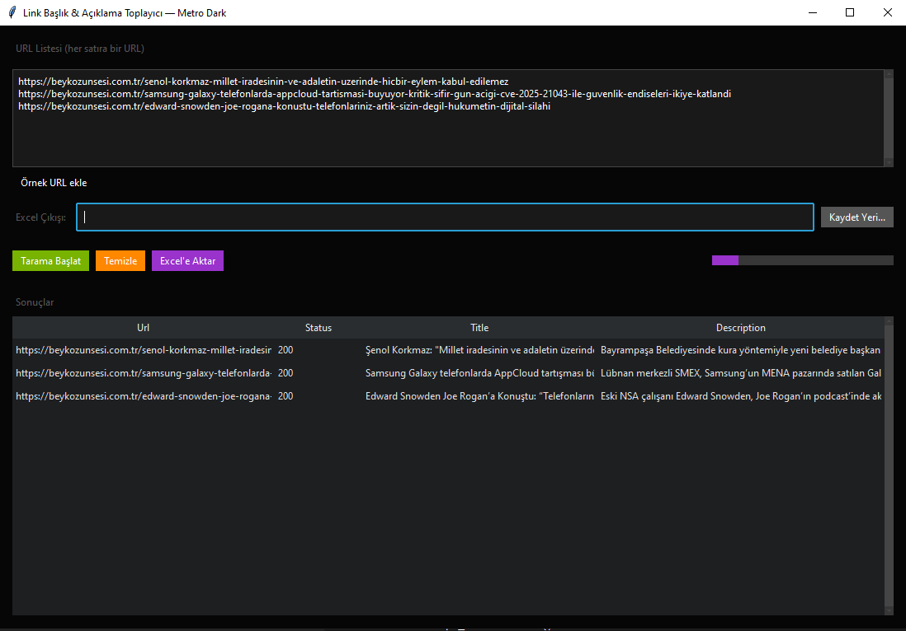

# Link Scraper GUI — Metro Dark

Basit bir GUI uygulaması ile girilen URL listesinden sayfa başlığı ve meta açıklama (title & description) bilgilerini toplayıp tablo halinde gösterir, Excel'e aktarır.
Arayüz Metro stili koyu (dark) tema ile tasarlanmıştır ve pencere boyutuna göre responsive çalışır.

------------------------------------------------------------
✨ Özellikler
------------------------------------------------------------
- Tkinter + ttkbootstrap (cyborg theme) ile modern Metro dark görünüm
- Çoklu URL tarama (thread pool ile hızlı sorgu)
- Başlık ve açıklamayı otomatik yakalama 
- Responsive arayüz: pencere büyüdükçe tablo kolonları otomatik genişler
- Sonuçları tablo (Treeview) içinde görme
- Excel (.xlsx) formatında dışa aktarma
- Kullanıcı dostu butonlar: Tarama Başlat, Temizle, Excel'e Aktar
- Dark uyumlu metin alanı, scrollbar ve progressbar

------------------------------------------------------------
📦 Kurulum
------------------------------------------------------------
<ol>
  <li>
    Gerekli bağımlılıkları yükle: 
    <pre><code>pip install requests pandas beautifulsoup4 lxml ttkbootstrap openpyxl</code></pre>
    veya <code>requirements.txt</code> dosyasını kullanarak: 
    <pre><code>pip install -r requirements.txt</code></pre>
  </li>
  <li>
    Depoyu klonla: 
    <pre><code>git clone https://github.com/ebubekirbastama/link-scraper-gui-metro-dark.git
cd link-scraper-gui-metro-dark</code></pre>
  </li>
  <li>
    Uygulamayı çalıştır: 
    <pre><code>python link_scraper_gui.py</code></pre>
  </li>
</ol>

------------------------------------------------------------
📑 Requirements.txt İçeriği
------------------------------------------------------------
requests
pandas
beautifulsoup4
lxml
ttkbootstrap
openpyxl

------------------------------------------------------------
🖼️ Ekran Görüntüsü
------------------------------------------------------------

------------------------------------------------------------
📄 Kullanım
------------------------------------------------------------
1. URL’leri metin kutusuna gir (her satıra bir URL).
2. "Tarama Başlat" butonuna tıkla.
3. Sonuçlar tabloya düşer.
4. "Excel'e Aktar" ile .xlsx olarak kaydet.

------------------------------------------------------------
📂 Dosya Yapısı
------------------------------------------------------------

<pre><code>link-scraper-gui-metro-dark/
│
├── link_scraper_gui.py    -> Ana uygulama dosyası
├── README.txt             -> Bu döküman
</code></pre>

------------------------------------------------------------
🖥️ Cross-Platform Desteği
------------------------------------------------------------
Bu proje cross-platform çalışır:
- Windows: python link_scraper_gui.py
- Linux:   python3 link_scraper_gui.py
- macOS:   python3 link_scraper_gui.py

Çünkü proje Python + Tkinter tabanlıdır ve kullanılan tüm kütüphaneler saf Python’dur. 
Her üç platformda da sorunsuz çalışır. Tek gereklilik Python 3.9+ kurulu olmasıdır.

------------------------------------------------------------
🔖 Lisans
------------------------------------------------------------
MIT License
Özgürce kullanabilir ve geliştirebilirsiniz.

------------------------------------------------------------
🤝 Katkı
------------------------------------------------------------
Pull request ve issue açabilirsiniz. Her türlü geliştirme önerisine açığım.
